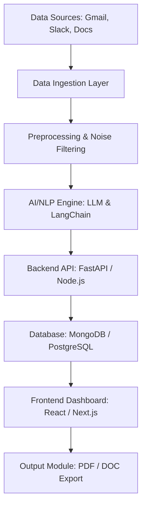

# 📄 Business Requirements Document (BRD) Generation Agent

> **Transforming scattered communication into structured business knowledge.**

An AI-powered software solution that automatically generates comprehensive Business Requirements Documents (BRDs) by extracting and analyzing data from multiple communication channels such as emails, meeting transcripts, chat platforms, and uploaded documents.

---

## 🚀 Problem Statement

Business requirements are often scattered across emails, meetings, chat messages, and informal documents. Manually consolidating this information into a structured BRD is:
- **Time-consuming** and inefficient.
- **Prone to errors** and omissions.
- **Difficult to trace** back to original sources.

This project builds an intelligent platform that collects, filters, and transforms unstructured communication into clear, actionable business documentation.

---

## ✨ Key Features

- **🔗 Multi-Source Integration**: Connects with Gmail, Slack, meeting transcripts, and local documents.
- **🧠 AI extraction**: Intelligent information extraction and summarization using LLMs.
- **📑 Automated BRD Generation**: Generates structured sections including:
  - Executive Summary & Business Objectives.
  - Stakeholder Analysis & Timeline.
  - Functional & Non-Functional Requirements.
  - Success Metrics & Assumptions.
- **✏️ Natural Language Editing**: Refine requirements using simple text commands.
- **📌 Source Citation**: Full explainability with traceable data sources.
- **📊 Insights**: Dashboards for requirement traceability and conflict detection.

---

## 🏗️ System Architecture

The system follows a modular, layered pipeline designed for scalability:

---

## 🛠️ Tech Stack

| Layer | Technology |
| :--- | :--- |
| **Frontend** | React / Next.js |
| **Backend** | Node.js / FastAPI |
| **AI/NLP** | Python, LangChain, OpenAI/Claude APIs |
| **Database** | MongoDB / PostgreSQL |
| **Integrations** | Gmail API, Slack API |
| **Deployment** | AWS / Azure / GCP |

---

## 📅 Roadmap & Future Enhancements

- [ ] **Advanced Conflict Resolution**: Real-time recommendations for requirement clashes.
- [ ] **Real-time Collaboration**: Multi-user editing and review cycles.
- [ ] **Multilingual Support**: Generate documentation in multiple languages.
- [ ] **Project Management Sync**: Direct integration with Jira, Trello, and Azure DevOps.

---

## 👥 Team
- **Ayushi Srivastava**

---

## 📜 License
This project is developed for hackathon and educational purposes.

---

## 🔮 Vision
To create an intelligent documentation assistant that transforms scattered communication into structured business knowledge, improving productivity, accuracy, and decision-making across organizations.
